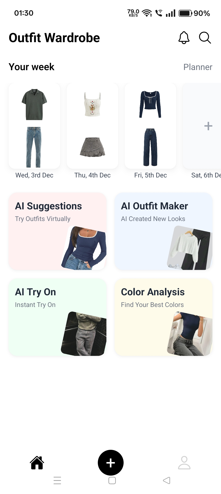

# 🧥 Outfit AI

> AI-powered mobile wardrobe assistant that helps users plan weekly outfits and get personalized fashion recommendations using advanced vector search AI.

---

## 📸 App Screenshots

  
  
  
  

---

## ✨ Features

- 👕 Plan & save outfits for each day of the week  
- 🤖 Fashion chat assistant powered by AI  
- 🧠 Smart outfit suggestions using Hugging Face embeddings + cosine similarity  
- 🔐 Secure JWT authentication & protected routes  
- ☁️ Cloudinary image uploads & optimization  
- ⚡ Smooth state management using Zustand  
- 🚀 Fast & scalable backend using Express & MongoDB  

---

## 🛠 Tech Stack

| Category | Technology |
|--------|------------|
| Mobile App | React Native (Expo), Zustand |
| Backend | Node.js, Express.js, MongoDB |
| AI | Hugging Face Vector Embeddings, Cosine Similarity Search |
| Cloud Storage | Cloudinary |
| Auth | JWT Authentication |

---

